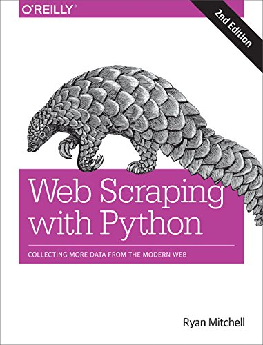

# Web Scraping With Python
## Book tests and codes

In this repository I will do some tests presented in the book and I will leave some sample codes.

## Chapters

1. ~~Your First Web Scraper~~
2. ~~Advanced HTML Parsing~~
3. ~~Writing Web Crawlers~~
4. Web Crawling Models
5. Scrapy
6. Storing Data
7. Reading Documents
8. Cleaning Your Dirty Data
9. Reading and Writing Natural Languages
10. Crawling Through Forms and Logins
11. Scraping JavaScript
12. Crawling Through APIs
13. Image Processing and Text Recognition
14. Avoiding Scraping Traps
15. Testing Your Website with Scrapers
16. Web Crawling in Parallel
17. Scraping Remotely
18. The Legalities and Ethics of Web Scraping

## Notes

- In `chapter_4/scrap_title.py` the first URL does not exists anymore. Use `scrap_title_fix.py`

## About Me

- Email: braulio@braulioti.com.br
- Twitter: [@_brau_io](http://twitter.com/braulio_info)
- GitHub: [braulioti](https://github.com/braulioti)
- Website: [brau.io](https://brau.io)
